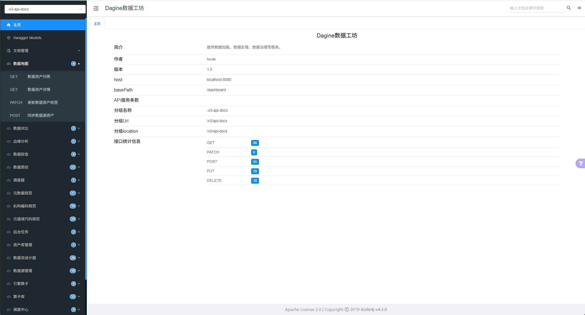

# knife4go

knife4go 是一个 Go 库，为 [gin](https://github.com/gin-gonic/gin) 服务挂载 [Knife4j](https://github.com/xiaoymin/knife4j) UI，把 swagger 文档渲染成开箱即用的接口文档页面。

**gin 与 swagger 一起使用**：knife4go 不解析接口注解、也不生成文档，它只负责把 OpenAPI 3.0 文档（OpenAPI JSON 字符串）注册到 gin，并提供 Knife4j UI 页面、文档端点与全部静态资产。文档通常由 [swag](https://github.com/swaggo/swag) 在你的项目中生成，经 `knife4go.Doc(doc)` 传入即可：

```
swag 生成文档 → swag.ReadDoc() → knife4go.Doc(doc) → InitSwaggerKnife(router) → Knife4j UI
```

一行接入，gin + swagger + Knife4j UI 一步到位。knife4go 自身不依赖 swag，swag 由宿主项目提供。

> UI 页面与文档端点均可通过 `DocPath` / `APIDocsPath` 自定义；`DocPath` 所在目录会作为 UI 静态资源的前缀，其它资源自动继承，无需重复声明。

> 同时提供 `huma/` 子包，为 [Huma v2](https://huma.rocks/) 挂载同一套 UI；其他 Web 框架只需实现约 15 行的 `knife4go.Router` 接口即可接入（见「扩展新框架」）。

全部 UI 资产已数据化内嵌，运行时不依赖任何外部静态文件。

## 快速开始（gin）

```go
import (
	"fmt"

	"github.com/gin-gonic/gin"
	"github.com/swaggo/swag"
	knife4go "github.com/smarteng/knife4go"

	_ "{module_path}/docs" // swag 生成的文档包，路径须与你项目的 swag 输出目录一致
)

// InitApiRouter 返回带 knife4go UI 的路由。
func InitApiRouter() *gin.Engine {
	router := gin.Default()
	// 注册到路由组时，端点自动带组前缀，如 /demo/swagger/index.html
	srv := router.Group("/demo")
	doc, err := swag.ReadDoc(swag.Name)
	if err != nil {
		panic(fmt.Errorf("read OpenAPI document from swag: %w", err))
	}
	if err := knife4go.InitSwaggerKnife(srv,
		knife4go.Doc(doc),
		knife4go.DocPath("/swagger/index.html"),
		knife4go.APIDocsPath("/swagger/doc.json"),
	); err != nil {
		panic(err)
	}
	return router
}
```

流程：

1. 在宿主项目安装 swag（`go install github.com/swaggo/swag/cmd/swag@latest`），按 swag 规则在接口上写注解，运行 `swag init` 生成文档；
2. 空白导入生成的 `docs` 包，使文档在运行时完成注册；
3. 通过 `swag.ReadDoc(swag.Name)` 读取文档，经 `knife4go.Doc(doc)` 传入 `InitSwaggerKnife` 完成挂载。

### 依赖

- Go 1.25 及以上
- [gin](https://github.com/gin-gonic/gin) v1.12.0
- [swag](https://github.com/swaggo/swag)：knife4go 不依赖它，由宿主项目自行引入用于生成文档

最小可运行示例见 [`_examples/gin`](./_examples/gin)。

## huma（可选）

需要为 [Huma v2](https://huma.rocks/) 服务挂载 UI 时，使用 `huma/` 子包（此时才会引入 Huma v2 依赖）：

```go
import (
	"fmt"

	"github.com/danielgtaylor/huma/v2"
	"github.com/danielgtaylor/huma/v2/adapters/humagin"
	"github.com/gin-gonic/gin"
	knife "github.com/smarteng/knife4go"
)

func main() {
	router := gin.Default()
	api := humagin.New(router, huma.DefaultConfig("demo", "v1"))

	openAPIDocument, err := api.OpenAPI().Downgrade()
	if err != nil {
		panic(fmt.Errorf("downgrade huma OpenAPI document: %w", err))
	}
	_ = knife.InitHumaKnife(api, knife.Doc(string(openAPIDocument)))
	_ = router.Run(":8080")
}
```

最小可运行示例见 [`_examples/huma`](./_examples/huma)。

## 自定义文档与路径

`Doc()` 也可传入任意来源的 OpenAPI 3.0 JSON（不限于 swag）。可通过下列选项自定义注册行为：

| Option | 默认值 | 说明 |
| --- | --- | --- |
| `Doc(json)` | 必填 | OpenAPI 3.0 JSON 字符串，原样注册，不做改写 |
| `DocPath(path)` | `/doc.html` | UI 页面路径；其所在目录会作为静态资源前缀，其它资源自动继承 |
| `APIDocsPath(path)` | `/swagger/doc.json` | OpenAPI 文档 JSON 端点路径，同时写入 `swagger-config.urls[0].url` |
| `Verbose(v)` | `false`（gin） | `true` 时保留 gin 注册 40 条静态资源的 `[GIN-debug]` 日志 |

```go
_ = knife4go.InitSwaggerKnife(router,
	knife4go.Doc(docJSON),
	knife4go.DocPath("/swagger/index.html"),
	knife4go.APIDocsPath("/swagger/doc.json"),
)
```

> 若 `APIDocsPath` 传入的路径已带上 `DocPath` 目录前缀（如上例都在 `/swagger/` 下），knife4go 不会二次拼接前缀。

## 注册位置

前端按文档 `paths` 是否已带注册位置前缀自适应，注册在根级还是带前缀的路由组都可以，无需声明前缀：

- **gin 路由组注册**（swag 文档无前缀）：前端基于 `doc.html` 位置拼接前缀，如注册在 `/demo` 组则 UI 位于 `/demo/doc.html`，调试请求自动带 `/demo` 前缀；
- **huma 前缀组注册**：`huma.NewGroup` 会把组前缀写入文档 `paths`，前端检测到已带前缀时不再拼接，直接使用文档中的完整路径；
- 文档始终**原样注册**，不做任何改写。

## HTTP 端点

注册后提供以下端点（注册在带前缀的路由组时自动带组前缀，如 `/demo/swagger/index.html`）：

| 路径 | 默认值 | 说明 |
| --- | --- | --- |
| UI 页面 | `/doc.html` | Knife4j UI 入口，可用 `DocPath()` 修改（示例：`/swagger/index.html`） |
| OpenAPI 文档 | `/swagger/doc.json` | OpenAPI 3.0 文档 JSON，可用 `APIDocsPath()` 修改 |
| UI 配置端点 | `/v3/api-docs/swagger-config` | Knife4j 前端硬编码探测的能力配置端点，路径固定不可修改 |
| oauth2 回调 | `/swagger-ui/oauth2-redirect.html` | OAuth2 授权回调页，随 UI 前缀自动前置 |

此外，`DocPath` 所在目录（如 `/swagger`）会作为 UI 前缀，40 条 knife4j 前端静态资源（`webjars/**`、`img/**` 等）都会挂在该前缀下。

## 扩展新框架

knife4go 的注册逻辑是框架无关的，接入新框架只需两步：

1. 实现 `knife4go.Router` 接口（仅一个方法，约 15 行），把每条静态路由注册为返回固定内容的 GET：

   ```go
   type Router interface {
   	// GET 注册一条 GET 路由，响应体固定为 content，Content-Type 为 contentType（空串表示不设置）。
   	GET(path, contentType string, content []byte)
   }
   ```

2. 调用 `knife4go.RegisterOpenAPI(router, opts...)`，或参照 `gin/`、`huma/` 子包封装 `InitSwaggerKnife` / `InitHumaKnife` 便捷入口。

## 示例效果



## Links

- [Knife4j](https://github.com/xiaoymin/knife4j)
- [Huma](https://huma.rocks/)

## 免责声明

本项目为公益项目，作者不对任何使用后果承担责任。

## License

[MIT LICENSE](./LICENSE)
